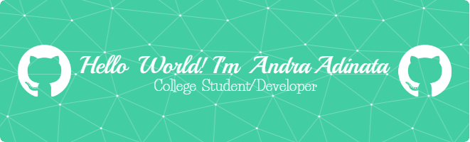

## Hello World! I'm Andra Adinata 👋

<!--
**AndraAdinata/AndraAdinata** is a ✨ _special_ ✨ repository because its `README.md` (this file) appears on your GitHub profile.

Here are some ideas to get you started:

- 🔭 I’m currently working on ...
- 🌱 I’m currently learning ...
- 👯 I’m looking to collaborate on ...
- 🤔 I’m looking for help with ...
- 💬 Ask me about ...
- 📫 How to reach me: ...
- 😄 Pronouns: ...
- ⚡ Fun fact: ...
-->

- 🔭 I’m currently working on UNJ [Computer Science](https://onlinelearning.unj.ac.id/) 
- 🌱 I’m currently learning **Rust**
🗿🗿🗿🗿🗿

#### 🔥Skills🔥

### ✨Contact Me With✨
 

Play Games With Me

###

<picture>
  <source media="(prefers-color-scheme: dark)" srcset="https://raw.githubusercontent.com/AndraAdinata/AndraAdinata/output/pacman-contribution-graph-dark.svg">
  <source media="(prefers-color-scheme: light)" srcset="https://raw.githubusercontent.com/AndraAdinata/AndraAdinata/output/pacman-contribution-graph.svg">
  
</picture>

###